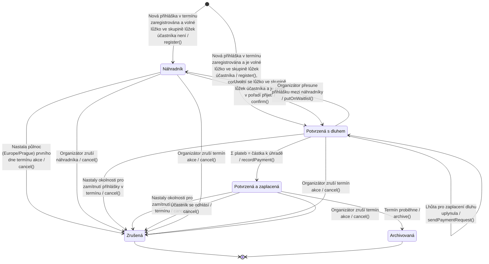

# Přihláška v termínu (životní cyklus, automatické vyhodnocování)

```mermaid
%%{init: {"state": {"rankSpacing": 90, "nodeSpacing": 40}}}%%
stateDiagram-v2
  state "Náhradník" as n_nahradnik
  state "Potvrzená s dluhem" as n_potvrzena_dluh
  state "Potvrzená a zaplacená" as n_potvrzena_zaplacena
  state "Zrušená" as n_zrusena
  state "Archivovaná" as n_archivovana
  [*] --> n_potvrzena_dluh : Nová přihláška v termínu<br/>zaregistrována a je volné<br/>lůžko ve skupině lůžek<br/>účastníka / register(),<br/>confirm()
  [*] --> n_nahradnik : Nová přihláška v termínu<br/>zaregistrována a volné<br/>lůžko ve skupině lůžek<br/>účastníka není /<br/>register()
  n_nahradnik --> n_potvrzena_dluh : Uvolní se lůžko ve skupině<br/>lůžek účastníka a je první<br/>v pořadí přijetí /<br/>confirm()
  n_nahradnik --> n_zrusena : Nastala půlnoc<br/>(Europe/Prague) prvního<br/>dne termínu akce /<br/>cancel()
  n_nahradnik --> n_zrusena : Organizátor zruší<br/>náhradníka / cancel()
  n_potvrzena_dluh --> n_nahradnik : Organizátor přesune<br/>přihlášku mezi náhradníky<br/>/ putOnWaitlist()
  n_potvrzena_dluh --> n_potvrzena_dluh : Lhůta pro zaplacení dluhu<br/>uplynula /<br/>sendPaymentRequest()
  n_potvrzena_dluh --> n_potvrzena_zaplacena : Σ plateb = částka k úhradě<br/>/ recordPayment()
  n_potvrzena_dluh --> n_zrusena : Nastaly okolnosti pro<br/>zamítnutí přihlášky v<br/>termínu / cancel()
  n_potvrzena_zaplacena --> n_zrusena : Nastaly okolnosti pro<br/>zamítnutí přihlášky v<br/>termínu / cancel()
  n_potvrzena_zaplacena --> n_zrusena : Účastník se odhlásí /<br/>cancel()
  n_potvrzena_zaplacena --> n_archivovana : Termín proběhne /<br/>archive()
  n_nahradnik --> n_zrusena : Organizátor zruší termín<br/>akce / cancel()
  n_potvrzena_dluh --> n_zrusena : Organizátor zruší termín<br/>akce / cancel()
  n_potvrzena_zaplacena --> n_zrusena : Organizátor zruší termín<br/>akce / cancel()
  n_zrusena --> [*]
  n_archivovana --> [*]
```
