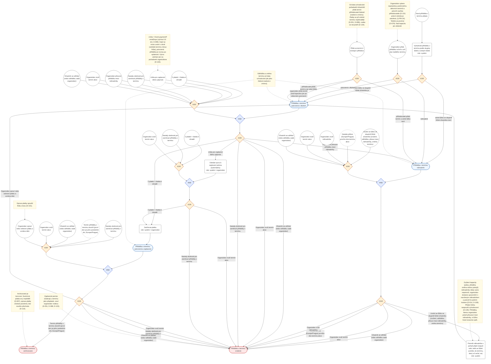

# Zpracování přihlášky v termínu (automatické vyhodnocování)

```mermaid
flowchart TD
  classDef ev fill:#ffffff,stroke:#333,stroke-width:1px
  classDef timed fill:#ffffff,stroke:#333,stroke-width:1px,stroke-dasharray:2 2
  classDef task fill:#ffffff,stroke:#333
  classDef proc fill:#e6fffa,stroke:#2c7a7b
  classDef st fill:#eef6ff,stroke:#2b6cb0
  classDef endst fill:#fde8e8,stroke:#c53030
  classDef gw_xor fill:#fff1d6,stroke:#c05621,stroke-width:2px
  classDef gw_and fill:#e3ecff,stroke:#2b4acb,stroke-width:2px
  classDef gw_or fill:#e2f7e8,stroke:#2f855a,stroke-width:2px
  classDef note fill:#fffbe6,stroke:#d69e2e,stroke-dasharray:3 3
  classDef unsure stroke-dasharray:4 3,stroke-width:2px,stroke:#d69e2e

  n_prihlaska_zaregistrovana(("Nová přihláška v<br/>termínu přijata"))
  n_vyhodnotit("Vyhodnotit přihlášku v<br/>termínu podle skupiny<br/>lůžek a volných lůžek<br/>role: systém")
  n_g_vysledek{"XOR"}
  n_e_rucni_pridani(("Organizátor přidá<br/>přihlášku ručně a určí<br/>stav každého termínu"))
  n_g_rucni{"XOR"}
  n_n_rucni["Organizátor vybere<br/>neprázdnou podmnožinu<br/>aktivních termínů a<br/>potvrdí souhlas<br/>přihlašovatele (D-153;<br/>právní stránka je<br/>otevřená, Q-PRI-24).<br/>Telefon je povinný<br/>(D-079). Nad kapacitu<br/>jen vědomě."]
  n_e_pridani_terminu(("Přidá se termín k<br/>existující přihlášce"))
  n_g_pridani{"XOR"}
  n_n_pridani["Od data schvalování<br/>požadavků účastníků<br/>přidá termín<br/>přihlašovatel žádostí<br/>(zadost-o-zmenu).<br/>Platby se při změně<br/>termínu nepřevádějí<br/>(D-051, D-088), vratka<br/>se nevytváří (D-134)."]
  n_s_zrusena(["Přihláška v termínu:<br/>zrušená"])
  n_s_nahradnik(["Přihláška v termínu:<br/>náhradník"])
  n_s_potvrzena_dluh(["Přihláška v termínu:<br/>potvrzená s dluhem"])
  n_uvolni_se_luzko(("Uvolní se lůžko ve<br/>skupině lůžek<br/>účastníka (zrušení,<br/>odhláška, přesun mezi<br/>náhradníky, změna<br/>termínu)"))
  n_e_zacatek(("Nastala půlnoc<br/>(Europe/Prague)<br/>prvního dne termínu<br/>akce"))
  n_e_zruseni_terminu_nahradnik(("Organizátor zruší<br/>termín akce"))
  n_e_zruseni_terminu_dluh(("Organizátor zruší<br/>termín akce"))
  n_e_zruseni_terminu_po_vyzve(("Organizátor zruší<br/>termín akce"))
  n_e_zruseni_terminu_zaplacena(("Organizátor zruší<br/>termín akce"))
  n_e_zruseni_nahradnika(("Organizátor zruší<br/>náhradníka"))
  n_e_presun(("Organizátor přesune<br/>přihlášku mezi<br/>náhradníky"))
  n_potvrdit_nahradnika("Potvrdit náhradníka v<br/>pořadí přijetí (nejvýš<br/>tolik, kolik se lůžek<br/>uvolnilo; do termínu,<br/>který už začal, ne)<br/>role: systém")
  n_n_kapacita["Zvýšení kapacity<br/>(pokoj, přistýlka,<br/>změna režimu pokojů)<br/>náhradníka nikdy samo<br/>nepotvrdí; organizátor<br/>dostane upozornění s<br/>navrženým náhradníkem<br/>a potvrdí ho jedním<br/>krokem (D-014, D-108).<br/>Přidání lůžka<br/>nespouští vyhodnocení<br/>(D-139). Přihláška,<br/>kterou organizátor<br/>právě přesunul mezi<br/>náhradníky, si lůžko<br/>hned nevezme zpět."]
  n_e_platby(("Σ plateb = částka k<br/>úhradě"))
  n_e_lhuta(("Lhůta pro zaplacení<br/>dluhu uplynula"))
  n_e_zamitnuti(("Nastaly okolnosti pro<br/>zamítnutí přihlášky v<br/>termínu"))
  n_zaucotovat("Zaúčtovat platbu<br/>role: systém / organizátor")
  n_vyzva("Odeslat výzvu k<br/>zaplacení jednou<br/>(automaticky<br/>role: systém / organizátor")
  n_e_platby_po_vyzve(("Σ plateb = částka k<br/>úhradě"))
  n_e_zamitnuti_po_vyzve(("Nastaly okolnosti pro<br/>zamítnutí přihlášky v<br/>termínu"))
  n_s_potvrzena_zaplacena(["Přihláška v termínu:<br/>potvrzená a zaplacená"])
  n_e_zamitnuti_zaplacena(("Nastaly okolnosti pro<br/>zamítnutí přihlášky v<br/>termínu"))
  n_e_termin(("Termín přihlášky v<br/>termínu skončil (první<br/>den po jeho posledním<br/>dni, Europe/Prague)"))
  n_e_odhlaska(("Účastník se odhlásí<br/>(nebo odhlášku zadá<br/>organizátor)"))
  n_e_odhlaska_dluh(("Účastník se odhlásí<br/>(nebo odhlášku zadá<br/>organizátor)"))
  n_e_odhlaska_nahradnik(("Účastník se odhlásí<br/>(nebo odhlášku zadá<br/>organizátor)"))
  n_n_zrusena["Zaplacené peníze<br/>zůstávají u termínu<br/>jako přeplatek, vrací<br/>organizátor vratkou<br/>(D-051, D-088, D-103)."]
  n_n_zadost["Odhláška a změna<br/>termínu od data<br/>schvalování jde přes<br/>žádost (zadost-o-<br/>zmenu)."]
  n_e_oprava_platby(("Organizátor opraví<br/>nebo odstraní platbu a<br/>vznikne dluh"))
  n_n_lhuta["Lhůta = Event.paymentP<br/>eriodDays (výchozí 10<br/>dní, D-099). Když se<br/>místo uvolní v okně<br/>(začátek termínu minus<br/>lhůta), potvrzená<br/>přihláška je rovnou po<br/>splatnosti. Výzva<br/>odchází jen na<br/>požadavek organizátora<br/>(D-102)."]
  n_n_oprava["Oprava platby spouští<br/>lhůtu znovu (D-101)."]
  n_s_archivovana(["Přihláška v termínu:<br/>archivovaná"])
  n_n_archivovana["Archivovaná je<br/>koncová. Souhrnná<br/>platba se jí nepřidělí<br/>(D-087), oprava platby<br/>zůstává povolená, bez<br/>nového přechodu<br/>(D-110)."]
  n_sync_s_nahradnik{"AND"}
  n_alt_s_nahradnik{"XOR"}
  n_split_s_nahradnik{"XOR"}
  n_sync_s_potvrzena_dluh{"AND"}
  n_alt_s_potvrzena_dluh{"XOR"}
  n_split_s_potvrzena_dluh{"XOR"}
  n_sync_vyzva{"AND"}
  n_alt_vyzva{"XOR"}
  n_split_vyzva{"XOR"}
  n_sync_s_potvrzena_zaplacena{"AND"}
  n_alt_s_potvrzena_zaplacena{"XOR"}
  n_split_s_potvrzena_zaplacena{"XOR"}

  n_prihlaska_zaregistrovana --> n_vyhodnotit
  n_vyhodnotit --> n_g_vysledek
  n_g_vysledek -->|"volné lůžko ve skupině<br/>lůžek účastníka je"| n_s_potvrzena_dluh
  n_g_vysledek -->|"volné lůžko ve skupině<br/>lůžek účastníka není"| n_s_nahradnik
  n_e_rucni_pridani --> n_g_rucni
  n_g_rucni -->|"potvrzená s dluhem"| n_s_potvrzena_dluh
  n_g_rucni -->|"náhradník"| n_s_nahradnik
  n_n_rucni -.-> n_e_rucni_pridani
  n_e_pridani_terminu --> n_g_pridani
  n_g_pridani -->|"organizátor přidá termín<br/>(nad kapacitou jen po<br/>vědomém potvrzení)"| n_s_potvrzena_dluh
  n_g_pridani -->|"přihlašovatel přidá<br/>termín a je volné lůžko"| n_s_potvrzena_dluh
  n_g_pridani -->|"přihlašovatel přidá<br/>termín a volné lůžko<br/>není"| n_s_nahradnik
  n_n_pridani -.-> n_e_pridani_terminu
  n_split_s_nahradnik -->|"Účastník se odhlásí<br/>(nebo odhlášku zadá<br/>organizátor)"| n_s_zrusena
  n_split_s_nahradnik -->|"Organizátor zruší termín<br/>akce"| n_s_zrusena
  n_split_s_nahradnik -->|"Uvolní se lůžko ve<br/>skupině lůžek účastníka<br/>(zrušení, odhláška,<br/>přesun mezi náhradníky,<br/>změna termínu)"| n_potvrdit_nahradnika
  n_split_s_nahradnik -->|"Nastala půlnoc<br/>(Europe/Prague) prvního<br/>dne termínu akce"| n_s_zrusena
  n_split_s_nahradnik -->|"Organizátor zruší<br/>náhradníka"| n_s_zrusena
  n_potvrdit_nahradnika --> n_s_potvrzena_dluh
  n_n_kapacita -.-> n_potvrdit_nahradnika
  n_split_s_potvrzena_dluh -->|"Účastník se odhlásí<br/>(nebo odhlášku zadá<br/>organizátor)"| n_s_zrusena
  n_split_s_potvrzena_dluh -->|"Organizátor zruší termín<br/>akce"| n_s_zrusena
  n_split_s_potvrzena_dluh -->|"Σ plateb = částka k<br/>úhradě"| n_zaucotovat
  n_split_s_potvrzena_dluh -->|"Lhůta pro zaplacení<br/>dluhu uplynula"| n_vyzva
  n_split_s_potvrzena_dluh -->|"Nastaly okolnosti pro<br/>zamítnutí přihlášky v<br/>termínu"| n_s_zrusena
  n_split_s_potvrzena_dluh -->|"Organizátor přesune<br/>přihlášku mezi<br/>náhradníky"| n_s_nahradnik
  n_split_vyzva -->|"Organizátor zruší termín<br/>akce"| n_s_zrusena
  n_split_vyzva -->|"Σ plateb = částka k<br/>úhradě"| n_zaucotovat
  n_split_vyzva -->|"Nastaly okolnosti pro<br/>zamítnutí přihlášky v<br/>termínu"| n_s_zrusena
  n_zaucotovat --> n_s_potvrzena_zaplacena
  n_split_s_potvrzena_zaplacena -->|"Organizátor opraví nebo<br/>odstraní platbu a<br/>vznikne dluh"| n_s_potvrzena_dluh
  n_n_oprava -.-> n_e_oprava_platby
  n_n_lhuta -.-> n_e_lhuta
  n_split_s_potvrzena_zaplacena -->|"Organizátor zruší termín<br/>akce"| n_s_zrusena
  n_split_s_potvrzena_zaplacena -->|"Nastaly okolnosti pro<br/>zamítnutí přihlášky v<br/>termínu"| n_s_zrusena
  n_split_s_potvrzena_zaplacena -->|"Účastník se odhlásí<br/>(nebo odhlášku zadá<br/>organizátor)"| n_s_zrusena
  n_n_zrusena -.-> n_s_zrusena
  n_n_zadost -.-> n_s_potvrzena_zaplacena
  n_n_zadost -.-> n_s_potvrzena_dluh
  n_n_zadost -.-> n_s_nahradnik
  n_split_s_potvrzena_zaplacena -->|"Termín přihlášky v<br/>termínu skončil (první<br/>den po jeho posledním<br/>dni, Europe/Prague)"| n_s_archivovana
  n_n_archivovana -.-> n_s_archivovana
  n_s_nahradnik --> n_sync_s_nahradnik
  n_alt_s_nahradnik --> n_sync_s_nahradnik
  n_uvolni_se_luzko --> n_alt_s_nahradnik
  n_e_zacatek --> n_alt_s_nahradnik
  n_e_zruseni_nahradnika --> n_alt_s_nahradnik
  n_e_zruseni_terminu_nahradnik --> n_alt_s_nahradnik
  n_e_odhlaska_nahradnik --> n_alt_s_nahradnik
  n_sync_s_nahradnik --> n_split_s_nahradnik
  n_s_potvrzena_dluh --> n_sync_s_potvrzena_dluh
  n_alt_s_potvrzena_dluh --> n_sync_s_potvrzena_dluh
  n_e_platby --> n_alt_s_potvrzena_dluh
  n_e_lhuta --> n_alt_s_potvrzena_dluh
  n_e_zamitnuti --> n_alt_s_potvrzena_dluh
  n_e_presun --> n_alt_s_potvrzena_dluh
  n_e_zruseni_terminu_dluh --> n_alt_s_potvrzena_dluh
  n_e_odhlaska_dluh --> n_alt_s_potvrzena_dluh
  n_sync_s_potvrzena_dluh --> n_split_s_potvrzena_dluh
  n_vyzva --> n_sync_vyzva
  n_alt_vyzva --> n_sync_vyzva
  n_e_platby_po_vyzve --> n_alt_vyzva
  n_e_zamitnuti_po_vyzve --> n_alt_vyzva
  n_e_zruseni_terminu_po_vyzve --> n_alt_vyzva
  n_sync_vyzva --> n_split_vyzva
  n_s_potvrzena_zaplacena --> n_sync_s_potvrzena_zaplacena
  n_alt_s_potvrzena_zaplacena --> n_sync_s_potvrzena_zaplacena
  n_e_zamitnuti_zaplacena --> n_alt_s_potvrzena_zaplacena
  n_e_termin --> n_alt_s_potvrzena_zaplacena
  n_e_odhlaska --> n_alt_s_potvrzena_zaplacena
  n_e_zruseni_terminu_zaplacena --> n_alt_s_potvrzena_zaplacena
  n_e_oprava_platby --> n_alt_s_potvrzena_zaplacena
  n_sync_s_potvrzena_zaplacena --> n_split_s_potvrzena_zaplacena

  class n_prihlaska_zaregistrovana,n_e_rucni_pridani,n_e_pridani_terminu,n_uvolni_se_luzko,n_e_zruseni_terminu_nahradnik,n_e_zruseni_terminu_dluh,n_e_zruseni_terminu_po_vyzve,n_e_zruseni_terminu_zaplacena,n_e_zruseni_nahradnika,n_e_presun,n_e_platby,n_e_zamitnuti,n_e_platby_po_vyzve,n_e_zamitnuti_po_vyzve,n_e_zamitnuti_zaplacena,n_e_odhlaska,n_e_odhlaska_dluh,n_e_odhlaska_nahradnik,n_e_oprava_platby ev
  class n_vyhodnotit,n_potvrdit_nahradnika,n_zaucotovat,n_vyzva task
  class n_g_vysledek,n_g_rucni,n_g_pridani,n_alt_s_nahradnik,n_split_s_nahradnik,n_alt_s_potvrzena_dluh,n_split_s_potvrzena_dluh,n_alt_vyzva,n_split_vyzva,n_alt_s_potvrzena_zaplacena,n_split_s_potvrzena_zaplacena gw_xor
  class n_n_rucni,n_n_pridani,n_n_kapacita,n_n_zrusena,n_n_zadost,n_n_lhuta,n_n_oprava,n_n_archivovana note
  class n_s_zrusena,n_s_archivovana endst
  class n_s_nahradnik,n_s_potvrzena_dluh,n_s_potvrzena_zaplacena st
  class n_e_zacatek,n_e_lhuta,n_e_termin timed
  class n_sync_s_nahradnik,n_sync_s_potvrzena_dluh,n_sync_vyzva,n_sync_s_potvrzena_zaplacena gw_and
```
