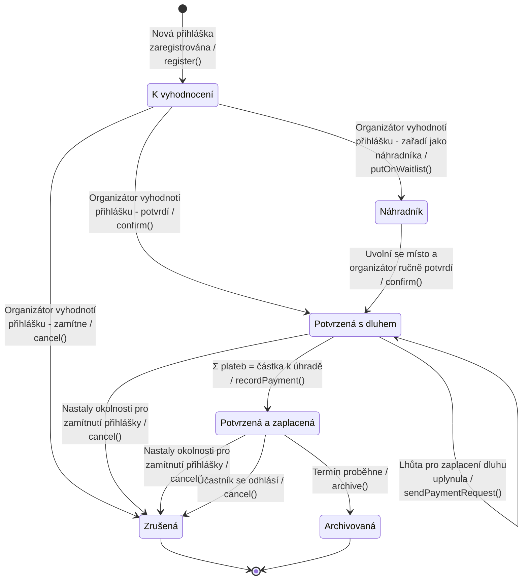

# Přihláška (životní cyklus)

```mermaid
%%{init: {"state": {"rankSpacing": 90, "nodeSpacing": 40}}}%%
stateDiagram-v2
  state "K vyhodnocení" as n_k_vyhodnoceni
  state "Náhradník" as n_nahradnik
  state "Potvrzená s dluhem" as n_potvrzena_dluh
  state "Potvrzená a zaplacená" as n_potvrzena_zaplacena
  state "Zrušená" as n_zrusena
  state "Archivovaná" as n_archivovana
  [*] --> n_k_vyhodnoceni : Nová přihláška<br/>zaregistrována /<br/>register()
  n_k_vyhodnoceni --> n_potvrzena_dluh : Organizátor vyhodnotí<br/>přihlášku - potvrdí /<br/>confirm()
  n_k_vyhodnoceni --> n_nahradnik : Organizátor vyhodnotí<br/>přihlášku - zařadí jako<br/>náhradníka /<br/>putOnWaitlist()
  n_k_vyhodnoceni --> n_zrusena : Organizátor vyhodnotí<br/>přihlášku - zamítne /<br/>cancel()
  n_nahradnik --> n_potvrzena_dluh : Uvolní se místo a<br/>organizátor ručně potvrdí<br/>/ confirm()
  n_potvrzena_dluh --> n_potvrzena_dluh : Lhůta pro zaplacení dluhu<br/>uplynula /<br/>sendPaymentRequest()
  n_potvrzena_dluh --> n_potvrzena_zaplacena : Σ plateb = částka k úhradě<br/>/ recordPayment()
  n_potvrzena_dluh --> n_zrusena : Nastaly okolnosti pro<br/>zamítnutí přihlášky /<br/>cancel()
  n_potvrzena_zaplacena --> n_zrusena : Nastaly okolnosti pro<br/>zamítnutí přihlášky /<br/>cancel()
  n_potvrzena_zaplacena --> n_zrusena : Účastník se odhlásí /<br/>cancel()
  n_potvrzena_zaplacena --> n_archivovana : Termín proběhne /<br/>archive()
  n_zrusena --> [*]
  n_archivovana --> [*]
```
