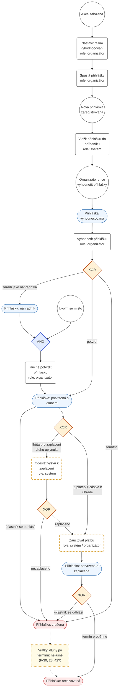

# Zpracování přihlášky (detailní proces, verze z náčrtku)

```mermaid
flowchart TD
  classDef ev fill:#ffffff,stroke:#333,stroke-width:1px
  classDef timed fill:#ffffff,stroke:#333,stroke-width:1px,stroke-dasharray:2 2
  classDef task fill:#ffffff,stroke:#333
  classDef proc fill:#e6fffa,stroke:#2c7a7b
  classDef st fill:#eef6ff,stroke:#2b6cb0
  classDef endst fill:#fde8e8,stroke:#c53030
  classDef gw_xor fill:#fff1d6,stroke:#c05621,stroke-width:2px
  classDef gw_and fill:#e3ecff,stroke:#2b4acb,stroke-width:2px
  classDef gw_or fill:#e2f7e8,stroke:#2f855a,stroke-width:2px
  classDef note fill:#fffbe6,stroke:#d69e2e,stroke-dasharray:3 3
  classDef unsure stroke-dasharray:4 3,stroke-width:2px,stroke:#d69e2e

  n_akce_zalozena(("Akce založena"))
  n_nastavit_rezim("Nastavit režim<br/>vyhodnocování<br/>role: organizátor")
  n_spustit_prihlasky("Spustit přihlášky<br/>role: organizátor")
  n_prihlaska_zaregistrovana(("Nová přihláška<br/>zaregistrována"))
  n_do_poradniku("Vložit přihlášku do<br/>pořadníku<br/>role: systém")
  n_chce_vyhodnotit(("Organizátor chce<br/>vyhodnotit přihlášky"))
  n_s_vyhodnocovana(["Přihláška:<br/>vyhodnocovaná"])
  n_vyhodnotit("Vyhodnotit přihlášku<br/>role: organizátor")
  n_g_vysledek{"XOR"}
  n_s_zrusena(["Přihláška: zrušená"])
  n_s_nahradnik(["Přihláška: náhradník"])
  n_s_potvrzena_dluh(["Přihláška: potvrzená s<br/>dluhem"])
  n_uvolni_se_misto(("Uvolní se místo"))
  n_g_misto{"AND"}
  n_rucne_potvrdit("Ručně potvrdit<br/>přihlášku<br/>role: organizátor")
  n_g_platba{"XOR"}
  n_zaucotovat("Zaúčtovat platbu<br/>role: systém / organizátor")
  n_vyzva("Odeslat výzvu k<br/>zaplacení<br/>role: systém")
  n_g_po_vyzve{"XOR"}
  n_s_potvrzena_zaplacena(["Přihláška: potvrzená a<br/>zaplacená"])
  n_g_termin{"XOR"}
  n_s_archivovana(["Přihláška: archivovaná"])
  n_poznamka_vratky["Vratky, dluhy po<br/>termínu: nejasné<br/>(F-30, 28, 42?)"]

  n_akce_zalozena --> n_nastavit_rezim
  n_nastavit_rezim --> n_spustit_prihlasky
  n_spustit_prihlasky --> n_prihlaska_zaregistrovana
  n_prihlaska_zaregistrovana --> n_do_poradniku
  n_do_poradniku --> n_chce_vyhodnotit
  n_chce_vyhodnotit --> n_s_vyhodnocovana
  n_s_vyhodnocovana --> n_vyhodnotit
  n_vyhodnotit --> n_g_vysledek
  n_g_vysledek -->|"zamítne"| n_s_zrusena
  n_g_vysledek -->|"potvrdí"| n_s_potvrzena_dluh
  n_g_vysledek -->|"zařadí jako náhradníka"| n_s_nahradnik
  n_uvolni_se_misto --> n_g_misto
  n_s_nahradnik --> n_g_misto
  n_g_misto --> n_rucne_potvrdit
  n_rucne_potvrdit --> n_s_potvrzena_dluh
  n_s_potvrzena_dluh --> n_g_platba
  n_g_platba -->|"Σ plateb = částka k<br/>úhradě"| n_zaucotovat
  n_g_platba -->|"lhůta pro zaplacení<br/>dluhu uplynula"| n_vyzva
  n_vyzva --> n_g_po_vyzve
  n_g_po_vyzve -->|"zaplaceno"| n_zaucotovat
  n_g_po_vyzve -->|"nezaplaceno"| n_s_zrusena
  n_zaucotovat --> n_s_potvrzena_zaplacena
  n_s_potvrzena_zaplacena --> n_g_termin
  n_g_termin -->|"termín proběhne"| n_s_archivovana
  n_g_termin -->|"účastník se odhlásí"| n_s_zrusena
  n_s_potvrzena_dluh -->|"účastník se odhlásí"| n_s_zrusena
  n_s_zrusena -.-> n_poznamka_vratky
  n_poznamka_vratky -.-> n_s_archivovana

  class n_akce_zalozena,n_prihlaska_zaregistrovana,n_chce_vyhodnotit,n_uvolni_se_misto ev
  class n_nastavit_rezim,n_spustit_prihlasky,n_do_poradniku,n_vyhodnotit,n_rucne_potvrdit,n_zaucotovat,n_vyzva task
  class n_s_vyhodnocovana,n_s_nahradnik,n_s_potvrzena_dluh,n_s_potvrzena_zaplacena st
  class n_g_vysledek,n_g_platba,n_g_po_vyzve,n_g_termin gw_xor
  class n_s_zrusena,n_s_archivovana endst
  class n_g_misto gw_and
  class n_zaucotovat,n_vyzva,n_poznamka_vratky unsure
  class n_poznamka_vratky note
```
