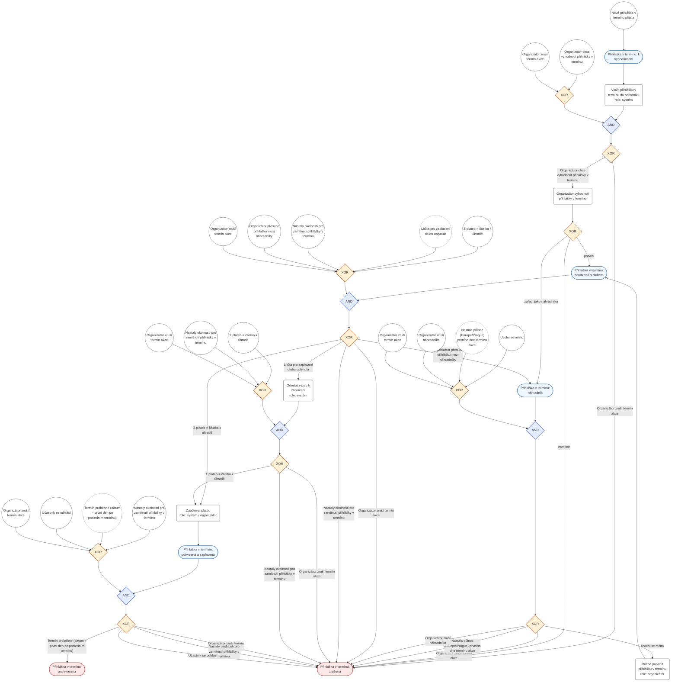

# Zpracování přihlášky v termínu (ruční vyhodnocování)

```mermaid
flowchart TD
  classDef ev fill:#ffffff,stroke:#333,stroke-width:1px
  classDef timed fill:#ffffff,stroke:#333,stroke-width:1px,stroke-dasharray:2 2
  classDef task fill:#ffffff,stroke:#333
  classDef proc fill:#e6fffa,stroke:#2c7a7b
  classDef st fill:#eef6ff,stroke:#2b6cb0
  classDef endst fill:#fde8e8,stroke:#c53030
  classDef gw_xor fill:#fff1d6,stroke:#c05621,stroke-width:2px
  classDef gw_and fill:#e3ecff,stroke:#2b4acb,stroke-width:2px
  classDef gw_or fill:#e2f7e8,stroke:#2f855a,stroke-width:2px
  classDef note fill:#fffbe6,stroke:#d69e2e,stroke-dasharray:3 3
  classDef unsure stroke-dasharray:4 3,stroke-width:2px,stroke:#d69e2e

  n_prihlaska_zaregistrovana(("Nová přihláška v<br/>termínu přijata"))
  n_do_poradniku("Vložit přihlášku v<br/>termínu do pořadníku<br/>role: systém")
  n_chce_vyhodnotit(("Organizátor chce<br/>vyhodnotit přihlášky v<br/>termínu"))
  n_s_k_vyhodnoceni(["Přihláška v termínu: k<br/>vyhodnocení"])
  n_vyhodnotit("Organizátor vyhodnotí<br/>přihlášky v termínu")
  n_g_vysledek{"XOR"}
  n_s_zrusena(["Přihláška v termínu:<br/>zrušená"])
  n_s_nahradnik(["Přihláška v termínu:<br/>náhradník"])
  n_s_potvrzena_dluh(["Přihláška v termínu:<br/>potvrzená s dluhem"])
  n_uvolni_se_misto(("Uvolní se místo"))
  n_e_zacatek(("Nastala půlnoc<br/>(Europe/Prague)<br/>prvního dne termínu<br/>akce"))
  n_e_zruseni_terminu_nahradnik(("Organizátor zruší<br/>termín akce"))
  n_e_zruseni_terminu_dluh(("Organizátor zruší<br/>termín akce"))
  n_e_zruseni_terminu_po_vyzve(("Organizátor zruší<br/>termín akce"))
  n_e_zruseni_terminu_zaplacena(("Organizátor zruší<br/>termín akce"))
  n_e_zruseni_terminu_kv(("Organizátor zruší<br/>termín akce"))
  n_e_zruseni_nahradnika(("Organizátor zruší<br/>náhradníka"))
  n_e_presun(("Organizátor přesune<br/>přihlášku mezi<br/>náhradníky"))
  n_rucne_potvrdit("Ručně potvrdit<br/>přihlášku v termínu<br/>role: organizátor")
  n_e_platby(("Σ plateb = částka k<br/>úhradě"))
  n_e_lhuta(("Lhůta pro zaplacení<br/>dluhu uplynula"))
  n_e_zamitnuti(("Nastaly okolnosti pro<br/>zamítnutí přihlášky v<br/>termínu"))
  n_zaucotovat("Zaúčtovat platbu<br/>role: systém / organizátor")
  n_vyzva("Odeslat výzvu k<br/>zaplacení<br/>role: systém")
  n_e_platby_po_vyzve(("Σ plateb = částka k<br/>úhradě"))
  n_e_zamitnuti_po_vyzve(("Nastaly okolnosti pro<br/>zamítnutí přihlášky v<br/>termínu"))
  n_s_potvrzena_zaplacena(["Přihláška v termínu:<br/>potvrzená a zaplacená"])
  n_e_zamitnuti_zaplacena(("Nastaly okolnosti pro<br/>zamítnutí přihlášky v<br/>termínu"))
  n_e_termin(("Termín proběhne (datum<br/>= první den po<br/>posledním termínu)"))
  n_e_odhlaska(("Účastník se odhlásí"))
  n_s_archivovana(["Přihláška v termínu:<br/>archivovaná"])
  n_sync_do_poradniku{"AND"}
  n_alt_do_poradniku{"XOR"}
  n_split_do_poradniku{"XOR"}
  n_sync_s_nahradnik{"AND"}
  n_alt_s_nahradnik{"XOR"}
  n_split_s_nahradnik{"XOR"}
  n_sync_s_potvrzena_dluh{"AND"}
  n_alt_s_potvrzena_dluh{"XOR"}
  n_split_s_potvrzena_dluh{"XOR"}
  n_sync_vyzva{"AND"}
  n_alt_vyzva{"XOR"}
  n_split_vyzva{"XOR"}
  n_sync_s_potvrzena_zaplacena{"AND"}
  n_alt_s_potvrzena_zaplacena{"XOR"}
  n_split_s_potvrzena_zaplacena{"XOR"}

  n_prihlaska_zaregistrovana --> n_s_k_vyhodnoceni
  n_s_k_vyhodnoceni --> n_do_poradniku
  n_split_do_poradniku -->|"Organizátor zruší termín<br/>akce"| n_s_zrusena
  n_split_do_poradniku -->|"Organizátor chce<br/>vyhodnotit přihlášky v<br/>termínu"| n_vyhodnotit
  n_vyhodnotit --> n_g_vysledek
  n_g_vysledek -->|"zamítne"| n_s_zrusena
  n_g_vysledek -->|"potvrdí"| n_s_potvrzena_dluh
  n_g_vysledek -->|"zařadí jako náhradníka"| n_s_nahradnik
  n_split_s_nahradnik -->|"Organizátor zruší termín<br/>akce"| n_s_zrusena
  n_split_s_nahradnik -->|"Uvolní se místo"| n_rucne_potvrdit
  n_split_s_nahradnik -->|"Nastala půlnoc<br/>(Europe/Prague) prvního<br/>dne termínu akce"| n_s_zrusena
  n_split_s_nahradnik -->|"Organizátor zruší<br/>náhradníka"| n_s_zrusena
  n_rucne_potvrdit --> n_s_potvrzena_dluh
  n_split_s_potvrzena_dluh -->|"Organizátor zruší termín<br/>akce"| n_s_zrusena
  n_split_s_potvrzena_dluh -->|"Σ plateb = částka k<br/>úhradě"| n_zaucotovat
  n_split_s_potvrzena_dluh -->|"Lhůta pro zaplacení<br/>dluhu uplynula"| n_vyzva
  n_split_s_potvrzena_dluh -->|"Nastaly okolnosti pro<br/>zamítnutí přihlášky v<br/>termínu"| n_s_zrusena
  n_split_s_potvrzena_dluh -->|"Organizátor přesune<br/>přihlášku mezi<br/>náhradníky"| n_s_nahradnik
  n_split_vyzva -->|"Organizátor zruší termín<br/>akce"| n_s_zrusena
  n_split_vyzva -->|"Σ plateb = částka k<br/>úhradě"| n_zaucotovat
  n_split_vyzva -->|"Nastaly okolnosti pro<br/>zamítnutí přihlášky v<br/>termínu"| n_s_zrusena
  n_zaucotovat --> n_s_potvrzena_zaplacena
  n_split_s_potvrzena_zaplacena -->|"Organizátor zruší termín<br/>akce"| n_s_zrusena
  n_split_s_potvrzena_zaplacena -->|"Nastaly okolnosti pro<br/>zamítnutí přihlášky v<br/>termínu"| n_s_zrusena
  n_split_s_potvrzena_zaplacena -->|"Účastník se odhlásí"| n_s_zrusena
  n_split_s_potvrzena_zaplacena -->|"Termín proběhne (datum =<br/>první den po posledním<br/>termínu)"| n_s_archivovana
  n_do_poradniku --> n_sync_do_poradniku
  n_alt_do_poradniku --> n_sync_do_poradniku
  n_chce_vyhodnotit --> n_alt_do_poradniku
  n_e_zruseni_terminu_kv --> n_alt_do_poradniku
  n_sync_do_poradniku --> n_split_do_poradniku
  n_s_nahradnik --> n_sync_s_nahradnik
  n_alt_s_nahradnik --> n_sync_s_nahradnik
  n_uvolni_se_misto --> n_alt_s_nahradnik
  n_e_zacatek --> n_alt_s_nahradnik
  n_e_zruseni_nahradnika --> n_alt_s_nahradnik
  n_e_zruseni_terminu_nahradnik --> n_alt_s_nahradnik
  n_sync_s_nahradnik --> n_split_s_nahradnik
  n_s_potvrzena_dluh --> n_sync_s_potvrzena_dluh
  n_alt_s_potvrzena_dluh --> n_sync_s_potvrzena_dluh
  n_e_platby --> n_alt_s_potvrzena_dluh
  n_e_lhuta --> n_alt_s_potvrzena_dluh
  n_e_zamitnuti --> n_alt_s_potvrzena_dluh
  n_e_presun --> n_alt_s_potvrzena_dluh
  n_e_zruseni_terminu_dluh --> n_alt_s_potvrzena_dluh
  n_sync_s_potvrzena_dluh --> n_split_s_potvrzena_dluh
  n_vyzva --> n_sync_vyzva
  n_alt_vyzva --> n_sync_vyzva
  n_e_platby_po_vyzve --> n_alt_vyzva
  n_e_zamitnuti_po_vyzve --> n_alt_vyzva
  n_e_zruseni_terminu_po_vyzve --> n_alt_vyzva
  n_sync_vyzva --> n_split_vyzva
  n_s_potvrzena_zaplacena --> n_sync_s_potvrzena_zaplacena
  n_alt_s_potvrzena_zaplacena --> n_sync_s_potvrzena_zaplacena
  n_e_zamitnuti_zaplacena --> n_alt_s_potvrzena_zaplacena
  n_e_termin --> n_alt_s_potvrzena_zaplacena
  n_e_odhlaska --> n_alt_s_potvrzena_zaplacena
  n_e_zruseni_terminu_zaplacena --> n_alt_s_potvrzena_zaplacena
  n_sync_s_potvrzena_zaplacena --> n_split_s_potvrzena_zaplacena

  class n_prihlaska_zaregistrovana,n_chce_vyhodnotit,n_uvolni_se_misto,n_e_zruseni_terminu_nahradnik,n_e_zruseni_terminu_dluh,n_e_zruseni_terminu_po_vyzve,n_e_zruseni_terminu_zaplacena,n_e_zruseni_terminu_kv,n_e_zruseni_nahradnika,n_e_presun,n_e_platby,n_e_zamitnuti,n_e_platby_po_vyzve,n_e_zamitnuti_po_vyzve,n_e_zamitnuti_zaplacena,n_e_odhlaska ev
  class n_do_poradniku,n_vyhodnotit,n_rucne_potvrdit,n_zaucotovat,n_vyzva task
  class n_s_k_vyhodnoceni,n_s_nahradnik,n_s_potvrzena_dluh,n_s_potvrzena_zaplacena st
  class n_g_vysledek,n_alt_do_poradniku,n_split_do_poradniku,n_alt_s_nahradnik,n_split_s_nahradnik,n_alt_s_potvrzena_dluh,n_split_s_potvrzena_dluh,n_alt_vyzva,n_split_vyzva,n_alt_s_potvrzena_zaplacena,n_split_s_potvrzena_zaplacena gw_xor
  class n_s_zrusena,n_s_archivovana endst
  class n_e_zacatek,n_e_lhuta,n_e_termin timed
  class n_sync_do_poradniku,n_sync_s_nahradnik,n_sync_s_potvrzena_dluh,n_sync_vyzva,n_sync_s_potvrzena_zaplacena gw_and
```
