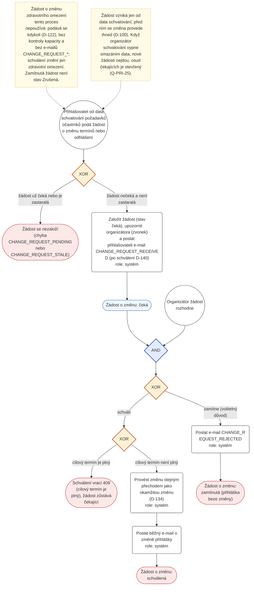

# Žádost o změnu přihlášky ke schválení

```mermaid
flowchart TD
  classDef ev fill:#ffffff,stroke:#333,stroke-width:1px
  classDef timed fill:#ffffff,stroke:#333,stroke-width:1px,stroke-dasharray:2 2
  classDef task fill:#ffffff,stroke:#333
  classDef proc fill:#e6fffa,stroke:#2c7a7b
  classDef st fill:#eef6ff,stroke:#2b6cb0
  classDef endst fill:#fde8e8,stroke:#c53030
  classDef gw_xor fill:#fff1d6,stroke:#c05621,stroke-width:2px
  classDef gw_and fill:#e3ecff,stroke:#2b4acb,stroke-width:2px
  classDef gw_or fill:#e2f7e8,stroke:#2f855a,stroke-width:2px
  classDef note fill:#fffbe6,stroke:#d69e2e,stroke-dasharray:3 3
  classDef unsure stroke-dasharray:4 3,stroke-width:2px,stroke:#d69e2e

  n_e_zadost(("Přihlašovatel od data<br/>schvalování požadavků<br/>účastníků podá žádost<br/>o změnu termínů nebo<br/>odhlášení"))
  n_g_ceka{"XOR"}
  n_e_chyba(["Žádost se nezaloží<br/>(chyba<br/>CHANGE_REQUEST_PENDING<br/>nebo<br/>CHANGE_REQUEST_STALE)"])
  n_zalozit("Založit žádost (stav<br/>čeká), upozornit<br/>organizátora (zvonek)<br/>a poslat<br/>přihlašovateli e-mail <br/>CHANGE_REQUEST_RECEIVE<br/>D (po schválení D-140)<br/>role: systém")
  n_s_ceka(["Žádost o změnu: čeká"])
  n_e_rozhodnuti(("Organizátor žádost<br/>rozhodne"))
  n_g_rozhodnuti{"XOR"}
  n_g_plny{"XOR"}
  n_e_plny(["Schválení vrací 409<br/>(cílový termín je<br/>plný), žádost zůstává<br/>čekající"])
  n_provest("Provést změnu stejným<br/>přechodem jako<br/>okamžitou změnu<br/>(D-134)<br/>role: systém")
  n_email_zmena("Poslat běžný e-mail o<br/>změně přihlášky<br/>role: systém")
  n_s_schvalena(["Žádost o změnu:<br/>schválená"])
  n_email_zamitnuti("Poslat e-mail CHANGE_R<br/>EQUEST_REJECTED<br/>role: systém")
  n_s_zamitnuta(["Žádost o změnu:<br/>zamítnutá (přihláška<br/>beze změny)"])
  n_n_zdravi["Žádost o změnu<br/>zdravotního omezení<br/>tento proces<br/>nepoužívá: podává se<br/>kdykoli (D-122), bez<br/>kontroly kapacity a<br/>bez e-mailů<br/>CHANGE_REQUEST_*;<br/>schválení změní jen<br/>zdravotní omezení.<br/>Zamítnutá žádost není<br/>stav Zrušená."]
  n_n_datum["Žádost vzniká jen od<br/>data schvalování; před<br/>ním se změna provede<br/>ihned (D-100). Když<br/>organizátor<br/>schvalování vypne<br/>smazáním data, nové<br/>žádosti nejdou, osud<br/>čekajících je otevřený<br/>(Q-PRI-25)."]
  n_sync_e_rozhodnuti{"AND"}

  n_e_zadost --> n_g_ceka
  n_g_ceka -->|"žádost už čeká nebo je<br/>zastaralá"| n_e_chyba
  n_g_ceka -->|"žádost nečeká a není<br/>zastaralá"| n_zalozit
  n_zalozit --> n_s_ceka
  n_s_ceka --> n_sync_e_rozhodnuti
  n_sync_e_rozhodnuti --> n_g_rozhodnuti
  n_g_rozhodnuti -->|"schválí"| n_g_plny
  n_g_plny -->|"cílový termín je plný"| n_e_plny
  n_g_plny -->|"cílový termín není plný"| n_provest
  n_provest --> n_email_zmena
  n_email_zmena --> n_s_schvalena
  n_g_rozhodnuti -->|"zamítne (volitelný<br/>důvod)"| n_email_zamitnuti
  n_email_zamitnuti --> n_s_zamitnuta
  n_n_zdravi -.-> n_e_zadost
  n_n_datum -.-> n_e_zadost
  n_e_rozhodnuti --> n_sync_e_rozhodnuti

  class n_e_zadost,n_e_rozhodnuti ev
  class n_g_ceka,n_g_rozhodnuti,n_g_plny gw_xor
  class n_e_chyba,n_e_plny,n_s_schvalena,n_s_zamitnuta endst
  class n_zalozit,n_provest,n_email_zmena,n_email_zamitnuti task
  class n_s_ceka st
  class n_n_zdravi,n_n_datum note
  class n_sync_e_rozhodnuti gw_and
```
